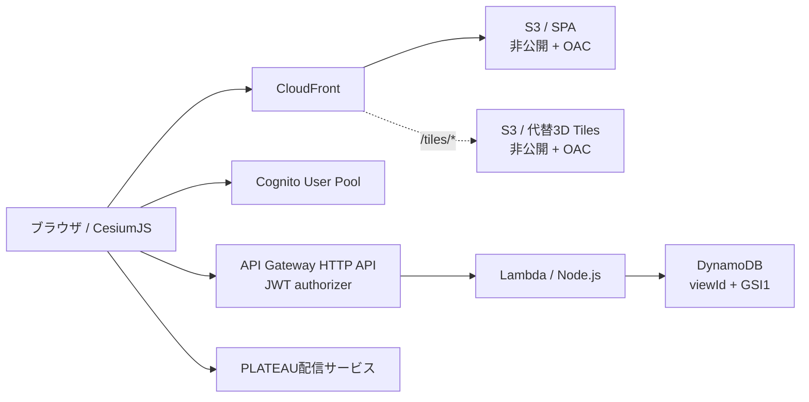

# PLATEAU Lens

PLATEAU Lensは、千代田区のPLATEAU 3D都市モデルを建物属性で絞り込み、その状態を保存・共有する非公式サンプルアプリです。ハッカソン参加者が、CesiumJSとAWSサーバーレス構成を自分の作品へ転用できることを目的にしています。

> 「垂直避難の受け入れ先候補」は属性による機械的な抽出例です。実際の避難施設指定や安全性を示すものではありません。耐震性、管理者との協定、開設体制、受け入れ可否は別途確認が必要です。

## 機能

- Cesium ionトークンを使わない、千代田区LOD2建物のブラウザ表示
- 高さ、地上階数、屋根投影面積、神田川L2浸水深による数値フィルター
- 建物用途、用途地域による分類フィルター
- 用途、高さ、浸水深による着色と凡例
- 建物クリックによる属性表示
- フィルターとカメラ状態を含むURL共有
- Cognito managed loginによるログイン・ログアウト
- 認証済みユーザーによるビュー保存、自分のビュー一覧、削除
- UUIDの共有リンクによる未ログイン閲覧

## アーキテクチャ



3D描画とフィルターはブラウザ内で完結します。Lambdaは3D Tilesを中継せず、保存ビューのCRUDだけを担当します。

## 技術構成

- TypeScript、Vite、CesiumJS
- AWS CDK v2（TypeScript）
- Amazon S3、Amazon CloudFront OAC
- Amazon Cognito User Pools
- Amazon API Gateway HTTP API
- AWS Lambda（Node.js 22）
- Amazon DynamoDB
- AWS Budgets
- Vitest、Playwright

## 前提

- Node.js 22.12以降またはNode.js 24 LTS
- npm 10以降
- E2Eテスト用のGoogle Chrome
- AWSへデプロイする場合のみ、AWS CLIとAWS CDK bootstrap済み環境
- `us-east-1`を利用できる非本番AWSアカウント

## ローカルでTier 1を動かす

```bash
npm ci
npm run dev
```

`http://127.0.0.1:5173/`を開きます。`predev`がCesiumのWorker、Draco、画像などを`web/public/cesium/`へ同期します。このディレクトリは生成物なので直接編集しないでください。

ローカルの既定設定ではクラウド保存機能が無効です。3D表示、フィルター、着色、属性表示、状態URL共有は利用できます。

事前検証結果を画面で確認する場合は、`http://127.0.0.1:5173/?diagnostics=1`を開きます。

## テストとビルド

```bash
npm run typecheck
npm test
npm run test:e2e
npm run build
npm run synth -- -c budgetEmail=alerts@example.com -c budgetAmount=10
```

| コマンド | 内容 |
|---|---|
| `npm test` | Web、Lambda、CDK assertionの単体テスト |
| `npm run test:e2e` | 実ブラウザでTier 1とモックAPIを使うTier 2シナリオを確認 |
| `npm run build` | 型検査、Cesium資産同期、Vite本番ビルド |
| `npm run synth` | 実Web資産と実Lambdaを含むCloudFormationテンプレートを生成 |
| `npm run verify` | 単体テスト、ビルド、CDK synthを連続実行 |

E2EはPLATEAU配信サービスへ接続します。外部サービス停止時は単体テストとビルドを先に確認してください。

## push前のシークレット検査

Gitleaksとgit-secretsを併用して、Git履歴、ステージ済み変更、追跡・未追跡ファイルを検査します。

```bash
brew install gitleaks git-secrets
npm run secrets:scan
```

`git-secrets --register-aws`は実行せず、スキャン時だけ`git -c`でAWSの標準パターンと`~/.aws/credentials` providerを渡します。このため、ユーザーまたはリポジトリーのGit設定を変更しません。`.gitallowed`はスキャンスクリプト自身の正規表現宣言と、`test/`内の架空12桁Account IDだけを除外します。実データを除外登録しないでください。

検出が1件でもある場合、コマンドは終了コード1で失敗します。検出値を削除または失効させ、必要ならGit履歴からも除去してから再実行してください。結果には`--redact=100`を指定し、Gitleaksが値そのものを表示しないようにしています。

## AWSへデプロイする前の確認

このスタックは短期サンプル用です。必ず非本番アカウントと最小権限の認証情報を使ってください。

```bash
export AWS_PROFILE="your-read-write-profile"
aws sts get-caller-identity --profile "$AWS_PROFILE"
```

表示されたAccount IDとRole ARNが対象環境であることを確認します。読み取りだけを行う確認では、可能ならReadOnlyプロファイルを使ってください。CDK bootstrapとdeployには書き込み権限が必要です。

初回だけbootstrapします。

```bash
ACCOUNT_ID=$(aws sts get-caller-identity --query Account --output text --profile "$AWS_PROFILE")
npx cdk bootstrap "aws://$ACCOUNT_ID/us-east-1" --profile "$AWS_PROFILE"
```

## デプロイ

`npm run deploy`は`BUDGET_EMAIL`、`BUDGET_AMOUNT`、`FALLBACK_ENABLED`、任意の`DEV_ORIGIN`を検証し、WebをbuildしてからCDKを実行します。`BUDGET_EMAIL`は空でない実在の通知先が必須で、`example.com`、`example.test`、`.invalid`などの例示・予約ドメインは拒否します。`BUDGET_AMOUNT`の既定値は`10`です。`devOrigin`を指定すると、そのoriginがAPI CORSとCognito callback/logout URLへ追加されます。値はリポジトリへ保存しないでください。

初回はフォールバックURLを無効にしてデプロイします。

```bash
export BUDGET_EMAIL="alerts@your-company.co.jp" # 実在の通知先へ置換
export BUDGET_AMOUNT="10"
export FALLBACK_ENABLED="false"
unset DEV_ORIGIN # 今回はローカルoriginをCORSとCognito callbackへ追加しない

npm run deploy -- --profile "$AWS_PROFILE"
```

`budgetEmail`を省略したsynthは警告付きで成功しますが、Budgetは作成されません。deploy wrapperは通知先が未設定または不正な場合、buildとCDK deployを開始せず終了します。フォールバックを有効にする場合は、後述の順序でタイル生成、S3 sync、`/tiles/*` invalidationを完了してから`FALLBACK_ENABLED=true`で再デプロイしてください。

デプロイ後のCloudFormation outputsには次が含まれます。

- `CloudFrontUrl`
- `ApiEndpoint`
- `UserPoolId`
- `UserPoolClientId`
- `CognitoLoginDomain`
- `WebBucketName`
- `TilesBucketName`

### ローカルからデプロイ済みTier 2へ接続する

`.env.example`を`.env.local`へコピーし、CloudFormation outputsの値を設定します。

```dotenv
VITE_API_BASE_URL=https://API_ID.execute-api.us-east-1.amazonaws.com
VITE_AWS_REGION=us-east-1
VITE_COGNITO_DOMAIN=https://COGNITO_DOMAIN.auth.us-east-1.amazoncognito.com
VITE_USER_POOL_CLIENT_ID=CLIENT_ID
VITE_REDIRECT_URI=http://localhost:5173/
```

スタックを`devOrigin=http://localhost:5173`付きでデプロイしていない場合、ローカルcallbackとAPI CORSは許可されません。

### テストユーザーを作る

自己サインアップは無効です。管理者がテスト用ユーザーを作成してください。

```bash
aws cognito-idp admin-create-user \
  --user-pool-id "USER_POOL_ID" \
  --username "test-user@example.com" \
  --user-attributes Name=email,Value="test-user@example.com" Name=email_verified,Value=true \
  --profile "$AWS_PROFILE" \
  --region us-east-1
```

実在する個人のメールアドレスをサンプルデータとして保存しないでください。DynamoDBにはCognitoの`sub`だけを所有者IDとして保存し、メールアドレスは保存しません。

## 認証・認可設計

Managed Login v2をAPIやCDKで構成する場合、domain設定だけではapp clientのログインページが有効になりません。本スタックは`AWS::Cognito::ManagedLoginBranding`でCognito標準styleをapp clientへ関連付けます。

| API | 認証 | 認可 |
|---|---|---|
| `POST /views` | 必須 | JWTの`sub`を所有者として保存 |
| `GET /views` | 必須 | JWTの`sub`で`GSI1`をQuery |
| `GET /views/{viewId}` | 不要 | UUID v4をcapability URLとして利用 |
| `DELETE /views/{viewId}` | 必須 | 保存済み`ownerSub`とJWTの`sub`が一致した場合だけ削除 |

所有者IDをクエリやリクエストボディから受け取ると、値の書き換えだけで他人の一覧を取得できるIDORにつながります。このためLambdaは`event.requestContext.authorizer.jwt.claims.sub`だけを信用します。フロントエンドは`ownerSub`やメールアドレスを送信しません。

本サンプルは実装の簡潔さを優先し、IDトークンをHTTP APIへ渡します。本番APIでは、CognitoリソースサーバーとOAuth scopeを定義し、アクセストークンでAPIを認可する方式を検討してください。ブラウザがJWT payloadを読む処理は表示上の期限確認だけであり、署名検証や認可を行いません。セキュリティ境界はAPI GatewayのJWT authorizerです。

共有URLを知っている人は未ログインでも保存状態を取得できます。フィルター、カメラ、ビュー名に機密情報を入れないでください。

## PLATEAU属性の確認方法

利用可能な属性は都市、年度、LODによって異なります。データカタログAPIから対象データセットを確認します。

```bash
curl -fsSL "https://api.plateauview.mlit.go.jp/datacatalog/plateau-datasets" \
  | jq '.latest_datasets[] | select(.city_code == "13101" and .type_en == "bldg" and .lod == "2")'
```

対象tilesetの子tilesetを開き、トップレベルの`properties`にある属性名と`minimum` / `maximum`を確認してください。本アプリが利用する主な属性は`web/src/cesium/attributes.ts`に定義されています。

日本語、コロン、括弧を含む属性は、CesiumJS 1.145では次の形式で参照します。

```text
${feature["荒川水系神田川流域（都道府県管理区間）_L2（想定最大規模）_浸水深"]}
```

## 外部配信停止に備えたフォールバック

PLATEAU配信サービスは試験運用でSLAがありません。フォールバックを有効にする場合は、次の順序を変えないでください。タイルが存在する前にURLを公開すると、障害時に利用できないフォールバックをアプリへ設定してしまいます。

1. 前述の手順で`FALLBACK_ENABLED=false`の初回デプロイを完了します。
2. 千代田区LOD2のテクスチャなしデータを取得し、外部参照をローカル相対参照へ書き換えます。

   ```bash
   npm run fallback:fetch
   ```

   生成先は`.cache/fallback-tiles/tiles/`です。2026-09-24時点の実測では約195 MiB、635ファイルでした。取得元の更新により変わります。スクリプトはHTTPSだけを許可し、レスポンスをchunk単位で読みます。`Content-Length`が欠損または実際より小さくても、単一ファイル64 MiBまたは総容量512 MiBを超えるchunkを受けた時点でreaderをcancelし、そのリソースの部分ファイルは書きません。ファイル数の上限は2,000です。
3. 専用タイルバケットへアップロードします。これはAWSへの書き込みです。対象Account IDとバケット名を確認してから実行してください。

   ```bash
   TILES_BUCKET=$(aws cloudformation describe-stacks \
     --stack-name sample-app-plateau-lens \
     --query "Stacks[0].Outputs[?OutputKey=='TilesBucketName'].OutputValue | [0]" \
     --output text \
     --profile "$AWS_PROFILE" \
     --region us-east-1)

   aws s3 sync ".cache/fallback-tiles/tiles" "s3://$TILES_BUCKET/tiles" \
     --profile "$AWS_PROFILE" \
     --region us-east-1
   ```

4. 以前の欠損レスポンスをCloudFront cacheへ残さないよう、`/tiles/*`だけをinvalidationします。これもAWSへの書き込みです。取得したDistribution IDを確認してから実行してください。

   ```bash
   DISTRIBUTION_ID=$(aws cloudformation list-stack-resources \
     --stack-name sample-app-plateau-lens \
     --query "StackResourceSummaries[?ResourceType=='AWS::CloudFront::Distribution'].PhysicalResourceId | [0]" \
     --output text \
     --profile "$AWS_PROFILE" \
     --region us-east-1)

   aws cloudfront create-invalidation \
     --distribution-id "$DISTRIBUTION_ID" \
     --paths "/tiles/*" \
     --profile "$AWS_PROFILE"
   ```

5. syncとinvalidationの成功を確認した後だけ、フォールバックURLを有効にして再デプロイします。

   ```bash
   export FALLBACK_ENABLED="true"
   npm run deploy -- --profile "$AWS_PROFILE"
   ```

CloudFrontの`/tiles/*`は非公開タイルバケットへOACで接続します。`FALLBACK_ENABLED=true`の場合だけ、アプリの`fallbackTilesetUrl`へ`https://CLOUDFRONT_DOMAIN/tiles/tileset.json`を設定します。falseの場合は空文字です。default behaviorのCloudFront Functionは`/foo`や`/foo/`のような末尾要素に拡張子がないSPA navigationだけを`/index.html`へrewriteします。`/tiles/*`にはFunctionを関連付けないため、欠損タイルの403/404はHTMLや200へ変換されません。

CDK標準の`BucketDeployment` constructが生成するprovider IAM policyには、CloudFront invalidation用アクションの`Resource: "*"`が含まれます。これはWeb資産デプロイ後に指定Distributionをinvalidationする標準construct由来の低リスク例外として扱います。アプリ本体のLambda実行roleにはこの権限を付与していません。

## リソース削除

この操作は、保存ビュー、Cognitoユーザー、S3内のWeb資産と代替タイル、API、Lambda、CloudFront、Budgetを永久に削除します。対象が非本番の本サンプルスタックであることと、必要なデータの退避が済んでいることを確認してください。

```bash
aws sts get-caller-identity --profile "$AWS_PROFILE"
npm run destroy -- --profile "$AWS_PROFILE"
```

CDKの確認プロンプトで、スタック名が`sample-app-plateau-lens`であることを再確認してから承認します。自動化で確認を省略しないでください。

## ディレクトリ構成

```text
web/             Vite/CesiumJSフロントエンド
lambda/          保存ビューAPI Lambda
infrastructure/  AWS CDKスタック
test/            VitestとPlaywrightテスト
scripts/         Cesium資産同期、フォールバック取得
output/proposal/ 企画書と実装引き継ぎ書
```

## データ、ライセンス、出典

画面にはPLATEAUの出典と利用条件を常時表示します。

- [Project PLATEAU](https://www.mlit.go.jp/plateau/)
- [PLATEAUサイトポリシー](https://www.mlit.go.jp/plateau/site-policy/)
- [PLATEAU 3D Tiles配信仕様](https://docs.plateauview.mlit.go.jp/datasets/3d-tiles/)
- [データカタログ シンプルAPI](https://docs.plateauview.mlit.go.jp/api/rest/operations/datacatalogplateau-datasets/)

PLATEAUデータは公共データ利用規約（第1.0版、PDL1.0）に基づき、CC BY 4.0互換として利用します。本リポジトリのソースコードは[MIT License](LICENSE)です。

外部資料の内容はライセンス順守のため要約・言い換えています。Content was rephrased for compliance with licensing restrictions.
