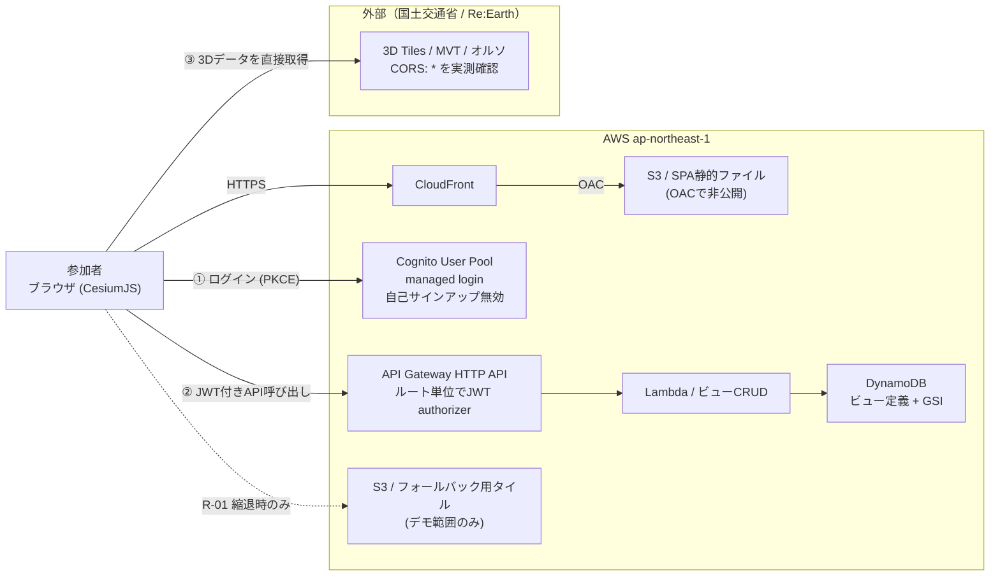

# PLATEAUハッカソン サンプルアプリ 企画書

| 項目 | 内容 |
|---|---|
| 作成日 | 2026-09-24（JST） |
| 版 | 確定版（Q-01 / Q-02 / 追加要件を反映） |
| 目的 | ハッカソン参加者にAWS上での実装イメージを与えるリファレンスアプリの企画 |
| 本書の位置づけ | 実装セッションへの引き継ぎ仕様。実装は別セッションで実施 |
| **開催日** | **2026-09-26（土）** ＝ 作成日から2日後。実装に充てられるのは実質 09-25（金）1日 |
| 対象リージョン | ap-northeast-1 |
| 技術検証 | 2026-09-24 に PLATEAU 配信サービスの CORS と属性構成を実測（第4章） |

---

## 1. エグゼクティブサマリー

**リポジトリ名: `sample-app-plateau-lens`**
**表示名: PLATEAU Lens — 属性フィルターでまちを切り出し、その視点を保存・共有するビューア**

指定条件（ブラウザ / PLATEAU 3Dデータ / フィルターレイヤー / AWSサーバレスのみ / Cognito認証 / 保存ビューの一覧画面）を満たしつつ、参加者が「自分のアイデアはこの雛形のどこを差し替えればいいか」を即座に理解できる構成にする。

設計の中核は3点。

1. **3D描画とフィルターは100%クライアントサイドで完結させる。** 実測の結果、PLATEAU配信サービスは全ドメインで `Access-Control-Allow-Origin: *` を返すため、プロキシもサーバサイドのジオ処理も不要。
2. **認証の位置づけを「いたずら防止」から「参加者が自分のアプリで使う型の提示」に置く。** 公開オープンデータを認証で守ることに意味はない（第2章 Q-02）。認証が守るのは、本アプリが追加する書き込みパスと一覧APIである。
3. **PLATEAU固有の詰まりどころを先に解いておく。** 属性名の実体、LODの選び方、Cesium ion への外部依存回避、出典表記。

構成は **Pattern A（フルクライアント描画 + 共有API）**。S3 + CloudFront / Cognito / API Gateway HTTP API / Lambda / DynamoDB の5要素のみ。

**残り2日のため、Tier 1（バックエンドなしで完結）→ Tier 2（認証と永続化）の順に積む。** Tier 1 だけでもデモが成立する構成にして、時間切れリスクを消す。

---

## 2. 確定した判断

### Q-01: 開催日 → **2026-09-26（土）** で確定

作成日（09-24 木）から2日。実装可能なのは 09-25（金）の1日と見る。第7章のスコープをこの前提で組み直した。

### Q-02: 認証で守る対象 → **PLATEAUデータではなく、本アプリが追加する書き込みパスと一覧API**

「PLATEAU配信サービス自体がパブリックにアクセス可能なら認証の意味はない」という指摘は正しい。公開オープンデータ（PDL1.0 / CC BY 4.0互換）の前に認証を置いても見せかけになる。したがって認証対象を次のように限定する。

| 脅威 | 認証で防げるか | 実際に必要な対策 |
|---|---|---|
| PLATEAUデータの取得 | ✗ 無意味（公開データ） | 不要 |
| 共有ビューへの不適切な文字列の投稿 | ○ 書ける人を絞れる／投稿者を追跡できる | 認証 ＋ 入力バリデーション |
| 他人の保存ビュー一覧の閲覧 | ○ | 認証 ＋ **JWTのsubによるサーバ側絞り込み**（第5.3章） |
| ボットによる公開POSTエンドポイントの探索 | ○ | 認証 |
| 大量書き込みによる費用増 | △ 認証だけでは不足 | HTTP APIのルートレベルスロットリング ＋ Budgetsアラート |

**認証を残す判断の根拠は「教材価値」である。** ハッカソン作品の多くはユーザー固有の状態を持つため、認証→API→永続化の型を1本通しておくことが参加者にとって最も再利用性が高い。

### 追加要件: 保存ビューの一覧画面（認証で保護）

一覧画面を追加する。重要な設計上の注意を第5.3章に記載した。**画面を隠すことは対策ではなく、一覧APIをサーバ側で絞り込むことが本体である。**

### Q-07: 一覧の表示範囲 → **自分のビューのみ** で確定

`GET /views` は JWT の `sub` でGSIをQueryし、自分が保存したビューのみを返す。全参加者のビューを見せる機能は**スコープ外**とする（実装時間が1日であること、およびユーザー生成コンテンツを全員に露出させないため）。

この決定により、認可ロジックは1本に単純化される。**「一覧の所有者はJWTクレームから取得する」という実装を正しく見せることが本サンプルの主眼になる**（第5.3章）。

### 運用側の確認事項（実装をブロックしない）

| # | 確認事項 | 現時点の仮置き |
|---|---|---|
| Q-03 | 対象地域を千代田区で固定してよいか | 千代田区で固定。他都市の確認手順をREADMEに記載 |
| Q-04 | 参加者のスキルレベル | AWS初〜中級、JS読解可能 |
| Q-05 | 参加者アカウントの発行方法 | 主催者が事前に一括作成（自己サインアップ無効） |
| Q-06 | ハッカソン後の停止時期 | 翌週に削除 |

---

## 3. アプリ企画

### 3.1 コンセプト

> 「建物の属性でまちを絞り込み、その視点に名前を付けて保存・共有する」

PLATEAUの3D都市モデルは、形だけでなく建物ごとの属性を持つことが本質的な価値である。サンプルではその属性を触れる形で見せることに全振りする。

### 3.2 デモのユースケース

**題材: 荒川水系神田川が氾濫したとき、垂直避難の受け入れ先になりうる建物を属性フィルターだけで絞り込む**

対象は千代田区。実測で属性が最も揃っていた（建物ごとに浸水深が結合済み）ため、サーバサイドの空間演算をまったく書かずに防災ユースケースが成立する。

#### Tier 1 のデモ（バックエンドなしで完結）

| # | 操作 | 使う属性（実測レンジ） | 参加者に伝わること |
|---|---|---|---|
| 1 | 千代田区のLOD2建物が表示される | ― | PLATEAUがブラウザでそのまま動く |
| 2 | 高さ60m以上に絞る | `bldg:measuredHeight`（0.8〜209.5 m） | 属性フィルターが即座に効く |
| 3 | 用途で色分けする | `bldg:usage` | 形だけでなく意味情報がある |
| 4 | **浸水深0.5m以上を色分け＋抽出** | `荒川水系神田川流域（都道府県管理区間）_L2（想定最大規模）_浸水深`（0.1〜3.42 m） | **災害リスクが建物単位で最初から入っている** |
| 5 | 複合条件を重ねる | 浸水深 ≥ 0.5m **かつ** `bldg:storeysAboveGround` ≥ 4 **かつ** `uro:BuildingDetailAttribute_uro:buildingRoofEdgeArea` ≥ 1,000m² | 3条件で候補が浮かび上がる |
| 6 | 建物をクリックする | 浸水深・階数・住所・建物ID | 1棟ごとに根拠を確認できる |
| 7 | URLをコピーして別タブで開く | ― | 状態がURLに乗る。共有が成立する |

4番が山場。「浸水するのに、浸水深を超える階がある、広い建物」という3条件は3D都市モデルでなければ書けない。

使える災害リスク属性は他に `隅田川・新河岸川流域（都道府県管理区間）_L2（想定最大規模）_浸水深`（0.01〜4.05 m）、`高潮浸水想定_東京都高潮浸水想定区域図（令和6年12月19日）_浸水深`（0.01〜3.85 m）、`土砂災害リスク_急傾斜地の崩落_区域区分コード`（1〜2）。

#### Tier 2 のデモ（認証と永続化が登場）

| # | 操作 | 動くサービス | 参加者に伝わること |
|---|---|---|---|
| 8 | 「このビューを保存」→ 未ログインのためログイン画面へ | Cognito managed login | 認証の入口 |
| 9 | 「垂直避難候補_千代田」という名前で保存 | HTTP API（JWT authorizer）→ Lambda → DynamoDB | 認証→API→永続化の型 |
| 10 | **「マイビュー」を開き、保存済みビューの一覧を見る** | GET /views（認証必須、JWTのsubで絞り込み） | **一覧の認可はサーバ側で行う** |
| 11 | 一覧の項目をクリックして地図を復元する | GET /views/{viewId} | 状態の復元 |
| 12 | 発行された短縮URLを未ログインのブラウザで開く | 同上（読み取りは認証不要） | **読み取りは公開、書き込みと一覧は認証** |

#### Tier 1 の共有と Tier 2 の共有の違い（デモで明示する）

| | Tier 1（URLに状態を載せる） | Tier 2（名前付きビュー） |
|---|---|---|
| URL | 条件が全部載るので長い | 短いID（UUID） |
| 一覧 | できない | 自分のビューを並べられる |
| 帰属 | 誰が作ったか不明 | 作成者が分かる |
| 削除 | できない | 所有者が削除できる |

### 3.3 このユースケースを選んだ理由

1. **フィルター要件が自然に満たされる。** 抽出・着色・重ね合わせを単一の題材で全部見せられる
2. **認証に実質的な役割が生まれる。** 保存・一覧という行為があるため認証が飾りにならない
3. **PLATEAUの重点分野と一致する。** ビジョン2026 の注力サービス分野に「災害リスクの予測・可視化」「発災時の建物被害把握の迅速化」が挙がっている

### 3.4 デモで明示する限界

このフィルターで出るのは**機械的な候補**であり、実際の避難施設の指定ではない。耐震性、建物管理者との協定、開設体制、受け入れ可否は3D都市モデルの属性に含まれない。

これはサンプルの弱点ではなく、デモで言うべき内容とする。「データでここまで絞れる、ここからは人と現場の判断」という線を示すことで、参加者が自分のアイデアを考えるときの解像度が上がる。

### 3.5 フィルターレイヤーの実装方式

| 層 | 内容 | 実装 |
|---|---|---|
| **抽出フィルター** | 条件に合う建物のみ表示 | `Cesium3DTileStyle` の `show` 式 |
| **着色レイヤー** | 属性で色分け（連続値はグラデーション、分類値は離散色） | `Cesium3DTileStyle` の `color` 式 |
| **重ね合わせレイヤー** | 土地利用（MVT）、オルソ画像 | imageryとして追加（ストレッチ） |

いずれもクライアント側のスタイル指定のみで動く。フィルター変更時にデータを取り直す必要はない。数値属性はスライダー（`properties` の min/max を初期レンジに使う）、分類属性はチェックボックスとする。

---

## 4. 技術検証結果（2026-09-24 実測）

### 4.1 CORS: プロキシ不要で直接ロードできる

| 対象 | 結果 |
|---|---|
| `api.plateauview.mlit.go.jp`（複合 tileset.json） | `access-control-allow-origin: *` |
| `assets.cms.plateau.reearth.io`（3D Tiles 実体） | `access-control-allow-origin: *` |
| `tile.plateauview.mlit.go.jp`（オルソ画像タイル） | `access-control-allow-origin: *` |

→ **Lambdaによるプロキシは不要。** バックエンドはビューの保存・一覧・取得だけに専念できる。

あわせて、複合 tileset.json が実データを `assets.cms.plateau.reearth.io`（Re:Earth CMS のアセット領域）に外部参照していることが判明した。MLITドメインの他にもう1つ外部依存がある（R-01）。

### 4.2 使える属性: 千代田区 LOD2 で63項目

`tileset.json` の `properties` に、フィルター可能な属性が min/max 付きで宣言されていた。主なものを抜粋する。

| 分類 | 属性名 | 実測レンジ / 備考 |
|---|---|---|
| 形状 | `bldg:measuredHeight` | 0.8 〜 209.5（m） |
| 形状 | `bldg:storeysAboveGround` | 1 〜 44（階） |
| 形状 | `bldg:storeysBelowGround` | 0 〜 6（階） |
| 形状 | `uro:BuildingDetailAttribute_uro:buildingRoofEdgeArea` | 1.54 〜 22,322.6（m²） |
| 用途 | `bldg:usage`、`bldg:class` | 分類値 |
| 都市計画 | `uro:...:specifiedBuildingCoverageRate`（指定建蔽率） | 60 〜 80（%） |
| 都市計画 | `uro:...:specifiedFloorAreaRate`（指定容積率） | 300 〜 1300（%） |
| 都市計画 | `uro:...:districtsAndZonesType`（用途地域）、`landUseType`、`areaClassificationType` | 分類値 |
| 構造 | `uro:...:fireproofStructureType`（耐火構造種別） | 分類値 |
| 識別子 | `uro:BuildingIDAttribute_uro:buildingID` | 年度を跨いで同一性が保証される建物ID |
| **災害リスク** | `荒川水系神田川流域（都道府県管理区間）_L2（想定最大規模）_浸水深` | 0.1 〜 3.42（m） |
| **災害リスク** | `隅田川・新河岸川流域（都道府県管理区間）_L2（想定最大規模）_浸水深` | 0.01 〜 4.05（m） |
| **災害リスク** | `高潮浸水想定_東京都高潮浸水想定区域図（令和6年12月19日）_浸水深` | 0.01 〜 3.85（m） |
| **災害リスク** | `土砂災害リスク_急傾斜地の崩落_区域区分コード` | 1 〜 2 |

注意点。属性名に**日本語と記号（`:`、`（`）が含まれる**ため、スタイル式では `${['属性名']}` 形式でのアクセスが必要（R-04）。また属性は**都市ごとに異なる**（Q-03）。

### 4.3 認証方式

| 項目 | 確認結果 |
|---|---|
| SPAの認証フロー | Cognito managed login + Authorization Code Grant with PKCE |
| 自己サインアップ抑止 | ユーザープールの `AllowAdminCreateUserOnly` を有効化 |
| APIの保護 | HTTP API の JWT authorizer。**ルートごとに個別のauthorizerを設定でき、認証あり／なしのルートを1つのAPIに混在させられる** |
| Lambdaへのクレーム受け渡し | `event.requestContext.authorizer.jwt.claims.sub` で取得できる |
| 静的ファイルのエッジ保護 | CloudFront Functions は**ネットワーク呼び出しが禁止**されており JWKS 検証ができない。実現するなら Lambda@Edge（us-east-1、環境変数なし、同一ビューアイベントで CFF と併用不可）。**今回は採用しない** |

### 4.4 外部アカウント依存の回避

PLATEAUの公式サンプルコードは地形データ（PLATEAU-Terrain）を Cesium ion のアセットとして読み込むため、**Cesium ion のアクセストークンが必要**になる。参加者全員にサードパーティ登録を求めるのは当日の摩擦になるため、次の方針とする。

- 地形は使わない（またはCesiumJS同梱の Natural Earth II を下敷きにする）
- 背景画像は PLATEAU-Ortho（トークン不要、CORS確認済み）を使う
- `baseLayerPicker: false`、`geocoder: false` にして ion への通信を発生させない

未実測のため、実装セッションの最優先検証項目とする（R-03）。

---

## 5. アーキテクチャ（Pattern A）

### 5.1 構成

### 5.2 API 設計

**認証あり／なしをルート単位で分ける。** これが本サンプルの設計上の見せ場になる。

| メソッド | パス | 認証 | 用途 | 認可ロジック |
|---|---|:---:|---|---|
| `POST` | `/views` | **必須** | ビューを保存 | 所有者に JWT の `sub` を記録する |
| `GET` | `/views` | **必須** | **自分のビュー一覧（追加要件）** | **JWT の `sub` でGSIをQueryする。クライアントからの所有者指定は受け付けない** |
| `GET` | `/views/{viewId}` | 不要 | 共有リンクの読み取り | viewId は推測不可能なUUID（capability URL） |
| `DELETE` | `/views/{viewId}` | **必須** | ビューを削除 | 取得した所有者と JWT の `sub` が一致しなければ拒否する |

### 5.3 一覧APIの認可設計（最重要）

追加要件「保存したビューのリスト画面は、認証で保護してください」について、実装上の要点を明記する。

**フロントエンドで一覧画面を隠すことは対策ではない。** 画面のルートガードはUXであり、セキュリティ境界は `GET /views` に付けた JWT authorizer とLambda内の絞り込みである。

Lambdaは所有者を **必ず `event.requestContext.authorizer.jwt.claims.sub` から取得する。** クエリパラメータやリクエストボディで渡された所有者IDを信用してはならない。信用すると、パラメータを書き換えるだけで他人の一覧が引ける（IDOR）。

サンプルアプリでこの実装を正しく見せること自体に教材価値がある。READMEに「なぜクライアントから所有者を受け取らないのか」を1段落で書く。

### 5.4 DynamoDB 設計

共有リンク（viewIdだけで引く）と一覧（所有者で引く）の両方を満たすため、1テーブル＋1 GSI とする。

| | パーティションキー | ソートキー | 用途 |
|---|---|---|---|
| ベーステーブル | `viewId`（UUID） | ― | `GET /views/{viewId}`、`DELETE` |
| GSI1 | `ownerSub` | `createdAt` | `GET /views`（新しい順に並ぶ） |

格納する項目は `viewId` / `ownerSub` / `ownerName`（表示用）/ `title` / `filterState`（フィルター条件）/ `cameraState`（カメラ位置）/ `createdAt`。

**個人情報は保存しない。** `ownerSub` はCognitoの内部識別子であり、メールアドレスは保存しない。表示名は任意入力とする。

### 5.5 主要設計判断

| 項目 | 内容 |
|---|---|
| Decision | 3D描画とフィルター処理を完全にクライアントで実行し、バックエンドはビューの保存・一覧・取得に限定する |
| Alternatives considered | (a) Lambdaで3D Tilesをプロキシ・加工して返す (b) サーバサイドで属性を空間結合してから配信 |
| Pros | コード量が最小。参加者が全体を短時間で読める。CORSが `*` のため技術的にプロキシが不要。フィルター操作にネットワーク往復が入らない |
| Cons | 静的アセットは未認証でも取得可能。MLIT配信サービス（試験運用・SLAなし）に描画が依存する |
| W-A Pillar alignment | Operational Excellence（可動部が少ない）、Cost Optimization（転送・計算をAWS側に持たない）、Performance Efficiency（往復削減） |
| Trade-off | 外部サービスへの依存を受け入れる代わりに、構築工数と運用負荷を削る |
| General Design Principles applied | Automate to experiment、Evolutionary architecture（自前タイル配信へ段階移行できる） |

### 5.6 採用しなかった選択肢

| 選択肢 | 却下理由 |
|---|---|
| 自前タイル配信（全都市を事前変換してS3配信） | 準備工数が2日に収まらない。CORSが開放されていたため主な動機（プロキシ必要性）が消えた。**デモ範囲のみのフォールバックとして部分採用する** |
| Lambda@Edge で静的ファイルまで認証保護 | us-east-1限定、環境変数なし、エッジ反映に数分かかり試行サイクルが遅い。Q-02の結論（守る対象は書き込みと一覧API）から必要性が下がった |
| 書き込みパスを持たずURL共有のみ | 参加者が必ず必要になる認証・API・永続化の型を何も示せない |
| 書き込みパスを残して認証なし（スロットリングのみ） | 匿名のユーザー生成コンテンツが残り、コンテンツ責任を負う。本番で採らない設計を「型」として見せることになる |

---

## 6. スコープ

残り1日の実装時間を前提に、**Tier 1 だけでデモが成立する**構成にする。Tier 2 は Tier 1 への追加であり、書き直しにならない。

### Tier 1: バックエンドなし（優先度 最高）

| # | 機能 | 完了条件 |
|---|---|---|
| T1-01 | 千代田区のLOD2建物をブラウザに表示 | Cesium ion トークンなしで描画される |
| T1-02 | 数値属性フィルター（高さ、階数、屋根面積） | スライダー操作で表示対象が絞り込まれる |
| T1-03 | 分類属性フィルター（用途） | チェックボックスで表示対象が絞り込まれる |
| T1-04 | 災害リスクフィルター（浸水深） | デモの山場が動く |
| T1-05 | 着色レイヤー切り替え＋凡例 | 用途／高さ／浸水深で色が変わる |
| T1-06 | 建物クリックで属性表示 | 主要属性がパネルに出る |
| T1-07 | フィルター状態をURLに載せる | URLを開き直すと同じ画面が再現される |
| T1-08 | 出典表記 | PLATEAUの出典とライセンスが常時表示される（**ライセンス上の必須事項**） |

### Tier 2: 認証と永続化（優先度 高）

| # | 機能 | 完了条件 |
|---|---|---|
| T2-01 | Cognito managed login でのログイン／ログアウト | 自己サインアップが無効で、主催者発行アカウントでログインできる |
| T2-02 | `POST /views` でビューを保存 | 未ログインでは保存できない。保存後に短縮URLが出る |
| T2-03 | `GET /views/{viewId}` で復元 | 未ログインのブラウザでも共有URLが開ける |
| T2-04 | **`GET /views` + 一覧UI（追加要件）** | **ログイン必須。JWTのsubでサーバ側絞り込み。新しい順に並ぶ。項目クリックで地図が復元される** |
| T2-05 | `DELETE /views/{viewId}` | 所有者以外は削除できない |

### Tier 3: IaCとドキュメント（優先度 中）

| # | 機能 | 完了条件 |
|---|---|---|
| T3-01 | IaC（AWS SAM または CDK） | 1コマンドでデプロイできる |
| T3-02 | README | セットアップ手順、属性の確認方法、**削除手順**、認可設計の説明 |

### ストレッチ（当日は口頭でヒントとして提示）

| # | 機能 | 狙い |
|---|---|---|
| S-01 | フィルター結果の件数・合計床面積の集計表示 | 可視化から定量評価への接続 |
| S-02 | 重ね合わせレイヤー（土地利用MVT、オルソ画像） | レイヤー合成の実装例 |
| S-03 | 画面キャプチャをS3に保存して共有画像にする | S3 + 署名付きURLの実装例 |
| S-04 | 自然言語からフィルター条件を生成（Bedrock） | **認証が必要な理由として最も説得力がある**（従量課金の保護）。ただしモデルアクセス確認が必要で当日までの実現性は低い |
| S-05 | 他都市への切り替え | 「属性は都市ごとに違う」ことを体験させる教材価値 |
| S-06 | LOD1／LOD2 切り替えトグル | 性能対策（R-02）も兼ねる |

### スコープ外

- **「みんなのビュー」（全参加者のビュー一覧）** — Q-07 の決定によりスコープ外
- 本番運用を想定した可用性・監視設計
- PLATEAUデータの全国分の事前変換
- CityGMLの独自パース（変換済み3D Tilesを使うため不要）
- マルチテナント、ロールベースの権限管理
- 静的ファイルのエッジ認証（Lambda@Edge）

---

## 7. W-A 6柱の観点

ハッカソン用サンプルという性質上、「本番と同じ厳格さ」ではなく「参加者に伝えるべき最小の作法」を基準とする。

| 柱 | 本サンプルでの扱い |
|---|---|
| **Operational Excellence** | 全リソースをIaCで定義し、参加者が自分のアカウントに再現できる状態にする。READMEに削除手順を明記する。CloudWatch Logsは既定のまま使う |
| **Security** | 自己サインアップを無効化する。S3はOACでCloudFront経由のみに限定し、パブリックアクセスをブロックする。**一覧APIの所有者はJWTクレームから取得し、クライアント入力を信用しない（5.3章）**。DELETEは所有者一致を検証する。共有用viewIdは推測不可能なUUIDとし、capability URLであることをREADMEに明記する。Lambdaの権限は対象テーブルとGSIへの最小限に絞る。**個人情報を保存しない**。自前APIのCORSはCloudFrontドメインに限定する |
| **Reliability** | 外部配信サービスが試験運用であることを前提に、デモ範囲のタイルをS3に退避してフォールバック可能にする。DynamoDBはオンデマンドでキャパシティ枯渇を避ける |
| **Performance Efficiency** | 描画負荷の主因はLOD2テクスチャ。初期表示範囲を限定し `maximumScreenSpaceError` を調整する。フィルターはスタイル式でGPU側に寄せ、再フェッチを発生させない。一覧はGSIのQueryで取得し、Scanを使わない |
| **Cost Optimization** | 3Dデータの転送費をAWS側に持たない構成が最も安い。DynamoDBオンデマンド、Lambdaは低頻度。**Budgetsアラートを設定し、イベント翌週に削除する**。書き込み系ルートにスロットリングを設定する |
| **Sustainability** | ap-northeast-1 に集約し、不要なデータ変換・複製を行わない。既に公開されているタイルを再利用することが最も資源効率が良い |

---

## 8. リスクと緩和策

| # | リスク | 影響 | 緩和策 |
|---|---|---|---|
| **R-08** | **開催日が09-26（土）で実装時間が1日しかない** | 当日サンプルなし | **Tier 1 を先に完成させ、単独でデモ可能にする。T1-01が動いた時点で最低限成立する** |
| R-03 | Cesium ion トークンが必要になり参加者に登録を求める事態 | 当日の摩擦 | 地形を使わない構成で**実装の最初に確認**（未実測） |
| R-04 | 属性名に日本語・記号が含まれスタイル式が動かない | フィルターが機能しない | `${['属性名']}` 形式でのアクセスを**実装の最初に確認** |
| **R-09** | **一覧APIでクライアント指定の所有者を信用してしまう（IDOR）** | **他人のビューが閲覧可能になる** | **JWTクレームからsubを取得する実装を必須とし、READMEで理由を説明する（5.3章）** |
| R-01 | MLIT配信サービス（試験運用・SLAなし）が当日停止 | デモが成立しない | デモ範囲のタイルをS3に事前コピーし、設定切り替えでフォールバック |
| R-02 | 参加者PCの性能不足でLOD2が重い | 体験が悪化 | 初期表示範囲を狭める。LOD1切り替えトグル（S-06） |
| R-05 | 対象都市を変えたら属性が無く動かない | 参加者が詰まる | 千代田区で固定。属性の確認手順（tileset.jsonの`properties`を見る）をREADMEに記載 |
| R-06 | 出典表記の欠落 | **ライセンス違反** | Tier 1 の完了条件に含める（T1-08） |
| R-07 | ハッカソン後の削除漏れによる課金継続 | コスト | Budgetsアラート＋削除手順の明記＋担当と期日を決める |
| R-10 | 共有URLが外部に流出する | 想定外の閲覧 | capability URLである旨をREADMEとUIに明記し、機密情報を入れない前提を示す。保存する内容はフィルター条件とカメラ位置のみ |

---

## 9. 実装セッションへの引き継ぎ

### 9.1 着手順（時間切れに強い順序）

**まず設計が変わりうる項目を潰す。**

| 順 | 内容 | 失敗時の影響 |
|---|---|---|
| 1 | Cesium ion トークンなしで3D Tilesが描画できるか（R-03） | 参加者にトークン取得を求める必要が生じる |
| 2 | 日本語・記号入り属性名でスタイル式が動くか（R-04） | フィルターの実装方式を変える |
| 3 | JWT authorizer 経由でLambdaまで到達し、`sub` が取得できるか | 認証設計の見直し |

**その後の順序**

1. T1-01（3D表示）→ **ここで一度デモ可能になる**
2. T1-02 / T1-03 / T1-04（フィルター）→ T1-05（着色）
3. T1-06（属性表示）→ T1-07（URL共有）→ T1-08（出典）
4. **Tier 1 完了時点でデプロイして動作確認する（ここが最低ライン）**
5. T2-01（ログイン）→ T2-02 / T2-03（保存・復元）
6. T2-04（一覧UI。R-09に注意）→ T2-05（削除）
7. T3-01 / T3-02（IaC・README）

### 9.2 実装時に守る事項

- 一覧APIの所有者は必ず JWT クレームから取得する（R-09）
- 出典表記を消さない（R-06）
- 個人情報をDynamoDBに保存しない
- Budgetsアラートを設定する

### 9.3 他スキルへの連携

- **コスト試算**: 無料枠内の見込みだが、参加者数と転送量を置いた概算が必要なら cost-estimate Skill へ
- **構成図**: 掲示用のdraw.io構成図が必要なら diagram Skill へ
- **スライド**: 当日の紹介用スライドメモが必要なら slide Skill へ

---

## 10. 参照した一次情報

| # | 内容 | 出典 |
|---|---|---|
| R1 | PLATEAU配信サービスの仕様、データカタログAPI、複合tileset.json、試験運用である旨 | [PLATEAU-3DTiles / MVT](https://docs.plateauview.mlit.go.jp/datasets/3d-tiles/) |
| R2 | CORSヘッダ、tileset.jsonの`properties`（63項目・min/max） | 2026-09-24 に `curl` で実測（`api.plateauview.mlit.go.jp`、`assets.cms.plateau.reearth.io`、`tile.plateauview.mlit.go.jp`） |
| R3 | データ形式、LOD、位置正確度、属性が都市ごとに異なる点、出典表記義務 | [3D都市モデルの入手方法とデータ形式](https://www.mlit.go.jp/plateau/learning/tpc03-1/) / [LODレベルによる表現の違い](https://www.mlit.go.jp/plateau/learning/tpc03-3/) / [サイトポリシー](https://www.mlit.go.jp/plateau/site-policy/) |
| R4 | Cognito managed login の認証フロー | [User pool authentication with managed login](https://docs.aws.amazon.com/cognito/latest/developerguide/cognito-how-to-authenticate.html) |
| R5 | 自己サインアップの抑止（`AllowAdminCreateUserOnly`） | [Configuring policies for user creation](https://docs.aws.amazon.com/cognito/latest/developerguide/user-pool-settings-admin-create-user-policy.html) |
| R6 | JWT authorizer のルート単位設定、クレームのLambdaへの受け渡し（`requestContext.authorizer.jwt.claims`） | [Control access to HTTP APIs with JWT authorizers](https://docs.aws.amazon.com/apigateway/latest/developerguide/http-api-jwt-authorizer.html) |
| R7 | CloudFront Functions のネットワーク呼び出し禁止 | [CloudFront Functions JavaScript runtime — Restricted features](https://docs.aws.amazon.com/AmazonCloudFront/latest/DeveloperGuide/functions-javascript-runtime-20.html) |
| R8 | Lambda@Edge の制約、CFFとの併用禁止 | [Restrictions on edge functions](https://docs.aws.amazon.com/AmazonCloudFront/latest/DeveloperGuide/edge-function-restrictions-all.html) |
| R9 | HTTP API のルートレベルスロットリング | [Throttle requests to your HTTP APIs](https://docs.aws.amazon.com/apigateway/latest/developerguide/http-api-throttling.html) |
| R10 | Cesium ion に依存しないViewer構成 | [CesiumJS Offline Guide](https://github.com/CesiumGS/cesium/blob/main/Documentation/OfflineGuide/README.md)（コミュニティ情報。**実装セッションで実測して確定させる**） |
| R11 | PLATEAU全体像、ビジョン2026、整備状況 | `knowledge/2026-09-24_mlit-plateau-3d-city-model-overview.md` |

※ 外部情報は要約・言い換えのうえ引用している（Content was rephrased for compliance with licensing restrictions）。

---

## 11. 結論

Pattern A（S3+CloudFront / Cognito / HTTP API / Lambda / DynamoDB）で、「属性フィルターでまちを切り出し、その視点を保存・一覧・共有する」サンプルアプリを作る。

CORSが開放されていることを実測で確認したため、3D描画とフィルターはクライアント側で完結させ、バックエンドはビューの保存・一覧・取得に絞る。認証の位置づけは「いたずら防止」ではなく「参加者が自分のアプリで使う型の提示」とし、読み取りは公開・書き込みと一覧は認証という分け方を明示する。

追加要件の一覧画面は**自分のビューのみ**を対象とし、**画面を隠すのではなく一覧APIをサーバ側で絞り込むことが本体**であるとした。所有者をJWTクレームから取得する実装を必須とする（R-09）。この実装を正しく見せること自体が教材価値になる。

開催日が09-26（土）で実装時間が1日のため、Tier 1 を単独でデモ可能な状態に仕上げてから Tier 2 を積む。

**企画は確定。実装セッション向けの具体仕様は `実装引き継ぎ書_20260924.md` に分離した。**
